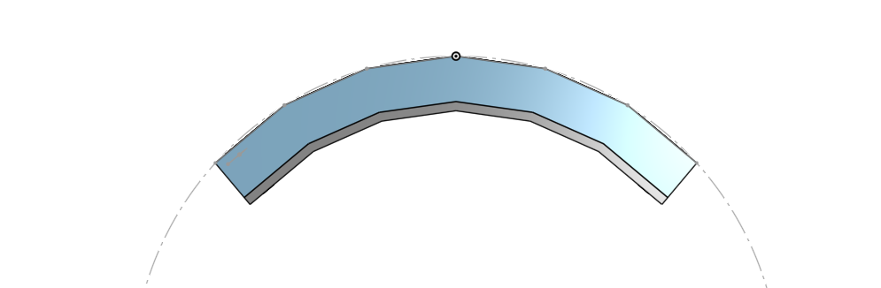
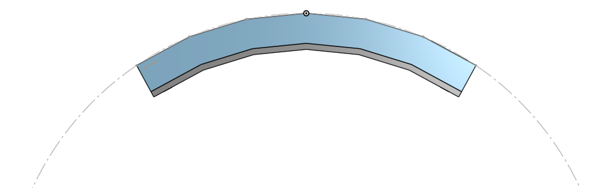
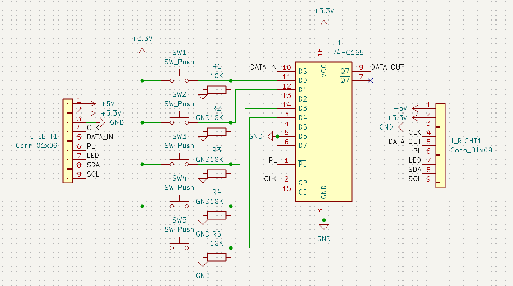

# Build Diary

A chronicle of building roamyboard — the pants-mounted modular keyboard. Started as a half-baked idea back in 2012, now finally coming together in 2026.

## The Dream

Why a pants keyboard‽ Because I think so much better when I'm moving. I want to code while I walk. For that, I need an input method that works while I'm moving around, sitting on a train, standing at a standing desk, pacing around the living room.

Eventually I'll also need a wearable computer and a head mounted display to go with this. But one thing at a time.

## Inspiration: ScottoChoczard & Lily58
*February 2025*

The general construction is based on [ScottoChoczard](https://scottokeebs.com/blogs/keyboards/scottochoczard-handwired-keyboard), because it's a straightforward hard-wired PCB-less design and thus doesn't have to be flat. It can follow the curve of the leg.

The hardware and layout is based on the [Lily58](https://typeractive.xyz/pages/build/lily58) — wireless, nice!nano based, more conventional 4-row layout so I don't have to go as deep in layers.

## Version 1: OnShape
*February 2025*

Started [designing in OnShape](https://cad.onshape.com/documents/851b4428f77cf5984ffec433/w/909caff9b78525c7946543d4/e/0bc4b4ece8e92a1460095204). Made a top case with holes for switches, similar to Choczard, but with the rough layout of lily58. So on each half: a 6x4 grid, plus an extra row of 4-ish thumb keys.

Learnings:
- Slightly higher curvature; it's too tight on my leg
- A good position on the leg is out towards the side, roughly 45° leaning, not centered on leg — right below/atop the pocket
- The plate is actually too thick for the keys to anchor properly
- Interestingly, it needs to be located at pocket height when standing up, and just above the knee when sitting down. So it'll need an adjustment system to move it up and down the leg.

## Version 2: Curvature experiments
*Spring 2025*

How much is the right curvature? I could math it. Or wing it. Still working in the same OnShape file. Here's v1 compared to wingin' it for v2:

## Version 3: The Modular Column Idea
*December 27-28, 2025*

Before even finishing version 2, Bengan wanted in on the project, but focused on just a single half and for gaming. That got me thinking: **what if roamyboard is made out of modular columns?** That you can snap together to make it as narrow or wide as you want. By making the edges sloped, you create curvature when snapping them together. Each column could then also have its own PCB.

- Each column is its own module
- Rightmost module is the brains (MCU, battery, USB-C)
- Leftmost is a passive terminator
- Any number of key modules in between
- A 74HC165 shift register in each key module, daisy-chained to the MCU

See [Modular Design (v3)](Modular%20Design%20\(v3\).md) for the full architecture and [Electronics](electronics/Electronics.md) for the electrical details.

## Learning CadQuery
*December 30, 2025*

For v3 I switched from OnShape to CadQuery. Source-driven parametric CAD feels right for something with this much repetition and parameterization. The file lives in `case/roamy-v3.py`.

Took some doing to get CadQuery running on my machine — had to run it from source. But once it works, it really works.

## Column Design Iteration

### 3.0
*December 30, 2025*

Learnings:
- Print standing up, not laying down. The supports going into the module are terrible.
- Make the T socket smaller. The tolerances won't allow it to go in.
- Keys are too wide apart. Make the groove negative, and remove some margins on the main body.

### 3.1
*January 2, 2026*

- Standing up print helped a lot!
- 0.275 top Z distance helped a lot to make supports easy to remove
- My clearance math is bad so I immediately rewrote it for 3.2
- Forgot to make the keys less wide apart

### 3.2
*January 2-3, 2026*

Nicer math for clearance.

### 3.3
*January 3, 2026*

Curvature!

Learnings:
- Too much clearance. The pieces don't snap together anymore.
- If I make two pieces that need to be glued together, there needs to be a groove or something to guide alignment when putting them back together. Made screw holes. Let's avoid glue.
- Being open on the top is actually pretty nice. I liked the initial idea of sliding the PCB in from the short end, but it will make debugging so much harder.
- The columns are now so narrow that the plastic clips on the switches don't engage and the switches just fall out. Make it wider so the clips can engage.

### 3.4
*January 4, 2026*

- The locking mechanism shouldn't have a hole to the body, and doesn't need that much x-space behind it
- Cutout for connection between modules
- ...ok now clearance is too LOW :/ I can't even force the pieces together more than a third of the way
- Screw holes are too small. M2 is 2 mm, so aim for that.

### 3.5
*January 4-5, 2026*

- Modularized so we can create different kinds of module boxes (MCU module, terminator module, key module)
- USB cutout, MCU attachment
- The tongue doesn't quite engage, and the bottoms don't quite align

### 3.6
*January 5, 2026*

Tried a weird clearance which is more like 3.1.

- The rails are STILL too tight
- The supports are killing me. Small details keep breaking.
- The tongue is too weak, it breaks. Make it thicker.
- The battery doesn't fit. Make the enclosure wider.

### 3.7
*January 6 – February 2, 2026*

- WTF, I changed clearance to 0.4 and it's STILL too tight‽ I can just barely make it work by shaving off debris
- Tree supports are great. Everything came off super easily without breaking.

### 3.8
*February 3-4, 2026*

It's perfect. Actually, I could add a rounding at the bottom of the T socket so that it slides into the groove more easily. And... I need more depth into the column to fit all the electronics :S I might have to print new lower halves.

## Experimenting with Electronics
*April 6, 2026*

With the mechanical design converging, time to actually think about how this thing works electrically.

Original plan was hand-wiring like ScottoChoczard. But with N columns and the modular architecture, I'd need some way to scan keys across an unknown number of physical modules. Solution: **74HC165 shift registers**, one per key module, daisy-chained.

Each 165 latches its 7 key states on /PL, then shifts them serially to the next module in the chain, until the MCU reads one long bitstream. Scale becomes free — every column added just extends the chain by one byte.

The cleverest bit: **how does the MCU know when the chain ends?** By tying the H input of every key module to GND, bit 7 of every real column's byte is always 0. Then the terminator module just ties serial DATA to +3.3V, producing 0xFF. The MCU reads bytes until it sees 0xFF — that's the sentinel, and the number of real columns is whatever came before it. No hardcoded column count, no configuration. Plug-and-play modular columns! Woop!!

Why not i2c? Because each column would need an identifier. BUT, I made room for an i2c bus on the interconnect, plus neopixel lines so we can potentially get some ergobled goodness up in this thing.

## First KiCad Schematic
*April 8-9, 2026*

Decided it was finally time to learn KiCad. I've wanted to do this for years. Started with just the key module since it's the most interesting one (the MCU module and terminator are simpler and can copy much of it).

First schematic ever! It's... a schematic!! ERC passes clean. 

## The Hand-Wired Prototype
*April 14, 2026*

Before committing to a PCB design, I wanted to validate the electrical concept on real hardware. So: hand-wire one column on a piece of protoboard, then drive it with an M5StickC Plus running a little Arduino script to clock out the 165 and visualize the key states.

**Five hours. Much blood, sweat, and tears.** For every solder join, I realized I should have done it in another order as now I had cables covering pin holes :( so much cable sheathing was melted. BUT -- no shorts‽ Could it be? Could this prototype maybe work on first try??

## IT WORKS‽‽‽‽‽
*April 14, 2026*

Plugged in the M5StickC. **First try!!** Keys show up on the display as I press them. The bit ordering matches the schematic. No magic smoke, no bus conflicts, no fried chips.

Then the real test: tied +3.3V to the left-side DATA pin to simulate the terminator, and the second chip in the tester (which was previously showing random noise) locked to all-ones. **The terminator sentinel trick works!** The entire modular architecture is validated! 🍺

## PCB design

Ok, now I know how to make a schematic and a footprint list, but I want to print PCBs so I don't have to spend five hours hand-soldering protoboards. So, that's the next leg on this journey.

### PCB v1.0
*2026-04-14*
![[pcb_v1_front.png]]
![[pcb_v1_back.png]]

Will this work? Only key switches on the front, and then the shift register, resistors and pin headers on the back. The headers will be pogo pins/receptacles, not regular pins like this.
The pins on the headers are riding VERY close to the key switch holes... No idea if it'll work. Now, routing!!