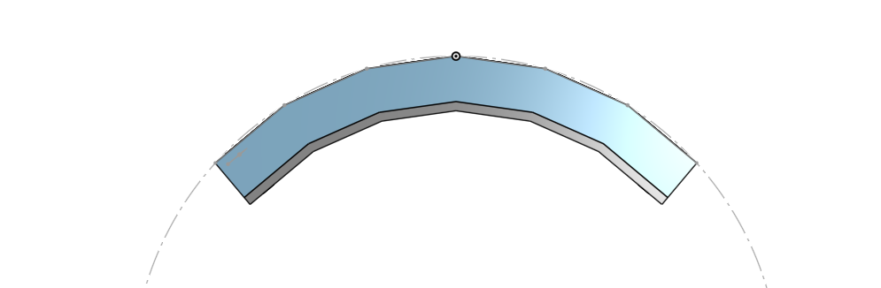
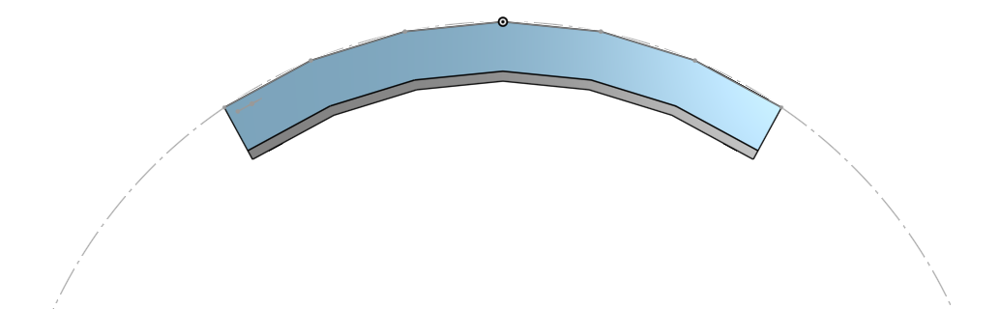
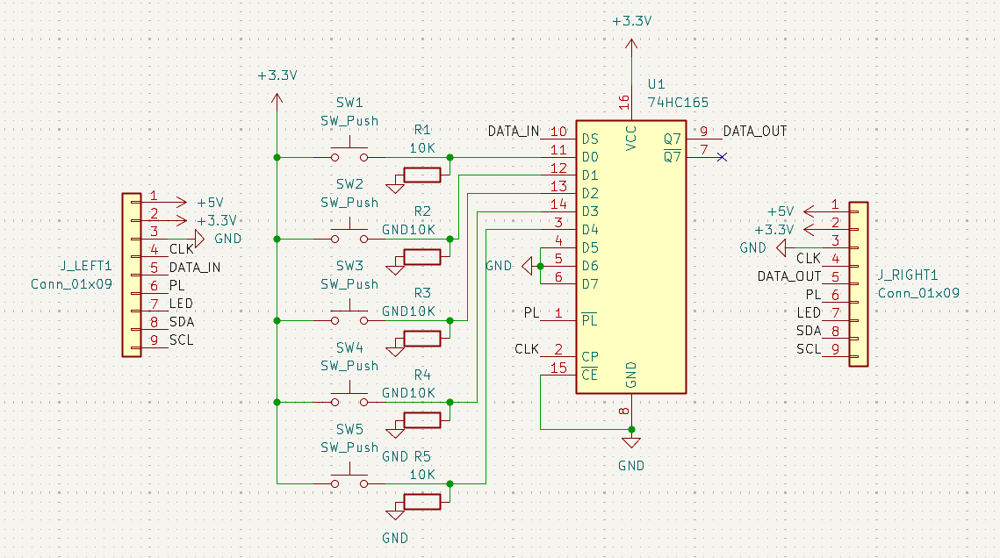
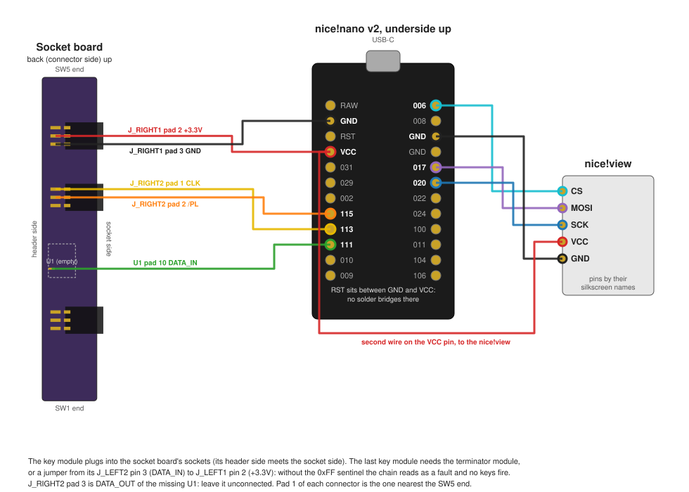

# Build Diary

A chronicle of building roamyboard — the pants-mounted modular keyboard. Started as a half-baked idea back in 2012, now finally coming together in 2026.

## The Dream

Why a pants keyboard‽ Because I think so much better when I'm moving. I want to code while I walk. For that, I need an input method that works while I'm moving around, sitting on a train, standing at a standing desk, pacing around the living room.

Eventually I'll also need a wearable computer and a head mounted display to go with this. But one thing at a time.

## Inspiration: ScottoChoczard & Lily58
*February 2025*

The general construction is based on [ScottoChoczard](https://scottokeebs.com/blogs/keyboards/scottochoczard-handwired-keyboard), because it's a straightforward hard-wired PCB-less design and thus doesn't have to be flat. It can follow the curve of the leg.

The hardware and layout is based on the [Lily58](https://typeractive.xyz/pages/build/lily58) — wireless, nice!nano based, more conventional 4-row layout so I don't have to go as deep in layers.

## Version 1: OnShape
*February 2025*

Started [designing in OnShape](https://cad.onshape.com/documents/851b4428f77cf5984ffec433/w/909caff9b78525c7946543d4/e/0bc4b4ece8e92a1460095204). Made a top case with holes for switches, similar to Choczard, but with the rough layout of lily58. So on each half: a 6x4 grid, plus an extra row of 4-ish thumb keys.

Learnings:
- Slightly higher curvature; it's too tight on my leg
- A good position on the leg is out towards the side, roughly 45° leaning, not centered on leg — right below/atop the pocket
- The plate is actually too thick for the keys to anchor properly
- Interestingly, it needs to be located at pocket height when standing up, and just above the knee when sitting down. So it'll need an adjustment system to move it up and down the leg.

## Version 2: Curvature experiments
*Spring 2025*

How much is the right curvature? I could math it. Or wing it. Still working in the same OnShape file. Here's v1 compared to wingin' it for v2:

## Version 3: The Modular Column Idea
*December 27-28, 2025*

Before even finishing version 2, Bengan wanted in on the project, but focused on just a single half and for gaming. That got me thinking: **what if roamyboard is made out of modular columns?** That you can snap together to make it as narrow or wide as you want. By making the edges sloped, you create curvature when snapping them together. Each column could then also have its own PCB.

- Each column is its own module
- Rightmost module is the brains (MCU, battery, USB-C)
- Leftmost is a passive terminator
- Any number of key modules in between
- A 74HC165 shift register in each key module, daisy-chained to the MCU

See [Modular Design (v3)](Modular%20Design%20\(v3\).md) for the full architecture and [Electronics](electronics/Electronics.md) for the electrical details.

## Learning CadQuery
*December 30, 2025*

For v3 I switched from OnShape to CadQuery. Source-driven parametric CAD feels right for something with this much repetition and parameterization. The file lives in `case/roamy-v3.py`.

Took some doing to get CadQuery running on my machine — had to run it from source. But once it works, it really works.

## Column Design Iteration

### 3.0
*December 30, 2025*

Learnings:
- Print standing up, not laying down. The supports going into the module are terrible.
- Make the T socket smaller. The tolerances won't allow it to go in.
- Keys are too wide apart. Make the groove negative, and remove some margins on the main body.

### 3.1
*January 2, 2026*

- Standing up print helped a lot!
- 0.275 top Z distance helped a lot to make supports easy to remove
- My clearance math is bad so I immediately rewrote it for 3.2
- Forgot to make the keys less wide apart

### 3.2
*January 2-3, 2026*

Nicer math for clearance.

### 3.3
*January 3, 2026*

Curvature!

Learnings:
- Too much clearance. The pieces don't snap together anymore.
- If I make two pieces that need to be glued together, there needs to be a groove or something to guide alignment when putting them back together. Made screw holes. Let's avoid glue.
- Being open on the top is actually pretty nice. I liked the initial idea of sliding the PCB in from the short end, but it will make debugging so much harder.
- The columns are now so narrow that the plastic clips on the switches don't engage and the switches just fall out. Make it wider so the clips can engage.

### 3.4
*January 4, 2026*

- The locking mechanism shouldn't have a hole to the body, and doesn't need that much x-space behind it
- Cutout for connection between modules
- ...ok now clearance is too LOW :/ I can't even force the pieces together more than a third of the way
- Screw holes are too small. M2 is 2 mm, so aim for that.

### 3.5
*January 4-5, 2026*

- Modularized so we can create different kinds of module boxes (MCU module, terminator module, key module)
- USB cutout, MCU attachment
- The tongue doesn't quite engage, and the bottoms don't quite align

### 3.6
*January 5, 2026*

Tried a weird clearance which is more like 3.1.

- The rails are STILL too tight
- The supports are killing me. Small details keep breaking.
- The tongue is too weak, it breaks. Make it thicker.
- The battery doesn't fit. Make the enclosure wider.

### 3.7
*January 6 – February 2, 2026*

- WTF, I changed clearance to 0.4 and it's STILL too tight‽ I can just barely make it work by shaving off debris
- Tree supports are great. Everything came off super easily without breaking.

### 3.8
*February 3-4, 2026*

It's perfect. Actually, I could add a rounding at the bottom of the T socket so that it slides into the groove more easily. And... I need more depth into the column to fit all the electronics :S I might have to print new lower halves.

## Experimenting with Electronics
*April 6, 2026*

With the mechanical design converging, time to actually think about how this thing works electrically.

Original plan was hand-wiring like ScottoChoczard. But with N columns and the modular architecture, I'd need some way to scan keys across an unknown number of physical modules. Solution: **74HC165 shift registers**, one per key module, daisy-chained.

Each 165 latches its 7 key states on /PL, then shifts them serially to the next module in the chain, until the MCU reads one long bitstream. Scale becomes free — every column added just extends the chain by one byte.

The cleverest bit: **how does the MCU know when the chain ends?** By tying the H input of every key module to GND, bit 7 of every real column's byte is always 0. Then the terminator module just ties serial DATA to +3.3V, producing 0xFF. The MCU reads bytes until it sees 0xFF — that's the sentinel, and the number of real columns is whatever came before it. No hardcoded column count, no configuration. Plug-and-play modular columns! Woop!!

Why not i2c? Because each column would need an identifier. BUT, I made room for an i2c bus on the interconnect, plus neopixel lines so we can potentially get some ergobled goodness up in this thing.

## First KiCad Schematic
*April 8-9, 2026*

Decided it was finally time to learn KiCad. I've wanted to do this for years. Started with just the key module since it's the most interesting one (the MCU module and terminator are simpler and can copy much of it).

First schematic ever! It's... a schematic!! ERC passes clean. 

## The Hand-Wired Prototype
*April 14, 2026*

Before committing to a PCB design, I wanted to validate the electrical concept on real hardware. So: hand-wire one column on a piece of protoboard, then drive it with an M5StickC Plus running a little Arduino script to clock out the 165 and visualize the key states.

**Five hours. Much blood, sweat, and tears.** For every solder join, I realized I should have done it in another order as now I had cables covering pin holes :( so much cable sheathing was melted. BUT -- no shorts‽ Could it be? Could this prototype maybe work on first try??

## IT WORKS‽‽‽‽‽
*April 14, 2026*

Plugged in the M5StickC. **First try!!** Keys show up on the display as I press them. The bit ordering matches the schematic. No magic smoke, no bus conflicts, no fried chips.

Then the real test: tied +3.3V to the left-side DATA pin to simulate the terminator, and the second chip in the tester (which was previously showing random noise) locked to all-ones. **The terminator sentinel trick works!** The entire modular architecture is validated! 🍺

## PCB design

Ok, now I know how to make a schematic and a footprint list, but I want to print PCBs so I don't have to spend five hours hand-soldering protoboards. So, that's the next leg on this journey.

### PCB v1.0
*2026-04-14*
![[pcb_v1_front.png]]
![[pcb_v1_back.png]]

Will this work? Only key switches on the front, and then the shift register, resistors and pin headers on the back. The headers will be pogo pins/receptacles, not regular pins like this.
The pins on the headers are riding VERY close to the key switch holes... No idea if it'll work. Now, routing!!

### PCB v1.1

Raj is showing me how to configure KiCad
* Minimum clearance, track width, connection width, annular width the same: 0.2mm to be able to get the cheapest "Min trach/spacing" on PCBWay (8/8 mil ≈ 0.2mm)
* hole to hole clearance should be at least the same as the hole size, or maybe even at least 0.5mm
* minimum via diameter is hole size plus copper, so 0.3+0.2+0.2 = 0.7
* copper to edge, pcbway lets us do down to 0.2, but 0.3 is a safer minimum
* You don't need to route ground. Just do ground fill (hit B to refill all zones)
	* Turn off "Draw Zone Fills" to not get distracted by it
	* Just re-fill zones after changing anything

For the pin situation... I think we're going to have to give up on pogo pins :( Let's do SMD pins, sets of 3, so we get mechanical connections. 
* Pins
	* Data sheet: https://content.harwin.com/m/0e0398fdb977d498/original/DRG-02613-Technical-Drawing-Datasheet-M20-791R-pdf.pdf
	* Product, wrong pin count: https://www.digikey.se/en/products/detail/harwin-inc/M20-7910642R/6559284
	* Product, 3 pins: https://www.digikey.se/en/products/detail/harwin-inc/M20-7910342R/6559281
* Then I need socket too
* This means I have to completely redo the module chassi to be something that clicks together from the side, instead of slides in from the top :( Don't know how I'm going to be able to do that with enough mechanical strength to not break... also, since there is an angle, I'm going to have to BEND THE PINS of the male connectors :( And just HOPE that that actually mates when I redesign the case and put everything together...

TODO:
- [x] Fix up footprint for 3 pins instead of 2 pins
- [x] Also make footprint for male side ()
- [ ] Change footprint in schematic
- [ ] Reroute with new footprints

![[3x3-pins.png]]

### Footprints, take two
*2026-09-14*

Came back after five months. The hand-made 3-pin footprint was a 2-pin one with a third pad glued on, so it was 1.27 mm off-center. Replaced both connector footprints with ones generated from the Harwin drawings (`electronics/tools/harwin_footprints.py`): socket M20-7910342R for the left edge, pin header M20-8890345R for the right edge. Next: swap the twelve placeholder footprints on the board for the real ones, fix the schematic connectors (still 1×9), and reroute.

### Placed
*2026-09-14, later*

Connectors placed in the gaps between keys, board narrowed to 16.5 mm (see the geometry table in [[Electronics]]). Old routing is stale and gets redone.

TODO:
- [ ] Reroute the key module
- [ ] Case v4 for the PCB: pocket for a 16.5 mm board, 1.2 mm side walls (column pitch ~19.3 mm), three pin slots through the slanted wall, three socket pockets in the flat wall, click joint instead of the T-slot. Numbers in [[Electronics]].
- [ ] Print the pin bend jig (build/roamy_pin_jig_*.stl) and bend one header to check springback

### The switch footprint is mirrored
*2026-09-16*

Ordered 20 boards, then noticed the switch 3D model's pins miss the socket cups. Checked against Kailh's PG1350 drawing (bottom view and pattern-side PCB layout) and daprice's `Kailh_socket_PG1350` footprint: a Choc inserted from the front needs its second contact to the left of the first, at (0, 5.95) and (-5, 3.75). Our kbd footprint has it on the right. foostan's boards place that footprint on the back layer, which mirrors it into the right handedness; ours sat on the front, and moving the pads to the back for the sockets did not fix the pattern. The boards in production cannot take sockets or switches. They still validate the interconnect, the bent pins, the 165 chain and the case fit.

Rev 2: the correct pattern rotated 180 degrees equals our pattern mirrored top-to-bottom, so the board keeps its width and the +3.3V pad stays on the right edge; the socket goes above each key, the connector rows and U1 move up about 8 mm, everything is rerouted. Use daprice's footprint at 180 degrees. Lesson: check a footprint's handedness against the part drawing, not against its own 3D model.

Execution plan for rev 2: [[Rev 2 plan]].

### Rev 2 laid out
*2026-09-16, afternoon*

JLCPCB support enabled "replace file" on the order, so rev 2 goes into the same order instead of a new one. The switch footprint is now our own (`tools/choc_footprint.py`, from the Kailh drawing, holes in the orientation that puts the socket above each key), the socket 3D model turned out to need only a 180° rotation, not a mirror, and the board is rerouted: DRC and ERC clean, parity clean, board 16.85 mm wide, connector rows at 58.1 / 77.1 / 115.1, U1 between keys 3 and 2. Deviations from the plan are recorded at the end of [[Rev 2 plan]]. Fab files regenerated in `electronics/KeyModule/fab/`, now named by revision (v4). A clean-context review against the Kailh drawing then caught the locating-peg holes at 1.70 mm for a 1.80 mm peg, inherited from daprice's footprint; v5 drills them at the drawing's 1.90 mm and puts the contact holes at the drawing's 5.90 / 3.80. v5 is what goes to JLCPCB.

A product photo of a Choc's underside shows one thick peg, two thin pegs and two metal legs, nothing else, so the footprint has no hole for a third pin.

### v5 boards in hand
*2026-09-23*

Purple v5 boards arrived, components not yet. A Choc drops into the holes and its keycap sits right; the pegs and centre boss are loose, as Kailh's 1.9 / 3.43 mm holes make them. Retention will come from the hotswap socket's spring contacts and from a lip or plate in case v4 that catches the switch's side clips; only if that is not enough does v6 go to 1.8 mm peg holes.

### It works
*2026-09-25*

First v5 module assembled and read on the first try: the shift-register test firmware on an M5Stick clocks the 74HC165 and every key shows up. Handedness, sockets, pull-downs and the chain wiring are all confirmed on hardware.

### Soldering jig
*2026-09-25*

Assembling the first module by hand showed three things: the pin bend jig bends in the wrong direction, a printed jig is too soft to bend the brass pins anyway, and headers and sockets placed by eye do not line up well enough to mate across columns. Replacement: a soldering jig that holds the board front down and locates the socket mouths and the header pins in slots beyond the board edges, with a variant that holds the header pins at 8° so nothing needs bending. Numbers and usage in [[Case design]].

### Case v4 in Cadova
*2026-09-25, evening*

Started the case over in Swift with Cadova instead of extending the CadQuery script: the joint, the board and the way the board enters the case all changed, so nothing but parameters carried over. The key module is a top shell plus a screwed-on floor, connectors through bottom-open wall slots, cantilever hooks between modules, headers at 8°. Design and numbers in [[Case design]] under 4.0. Verified with mesh sections rather than prints so far.

### The hanxia header is the wrong shape
*2026-09-25, late*

Soldering in the jig showed the header body wants to hang past the board edge. The hanxia drawings explain it: both parts float above the board on S-tails, pin and bore axis 2.3 mm up, not the Harwin 1.25 the footprints were drawn from. I first read the socket's jog as 1.3 and called the pair mismatched; a mated pair standing on its feet proved otherwise. Jig fixed for the hanxia body. For the joint angle: the header soldered tilted 8° puts its pin line 1.1 mm further from the board at the joint plane, and the case simply seats the neighbour 1.1 mm lower there, which is one rotation about a line 8 mm inboard and keeps every module on the same arc. Case v4 rebuilt on that; numbers in [[Electronics]] and [[Case design]].

### Measured, not read
*2026-09-26*

The 2.3 mm pin axis came from reading the hanxia drawings' 2.30 and 1.30 as tail jogs; they are foot lengths along the pin. Calipers: both bodies flush with their feet, 2.43 thick (datasheet 2.50), a mated pair lies flat on the table. Axis 1.25 mm from the board, both parts, as on the Harwin. Case v4 and the jig rebuilt on that. The tilted header still seats the neighbour about 1.1 mm lower at the seam, since that comes from the pivot, not the axis height.

### Mirrored
*2026-09-26*

The first Cadova jig came off the printer as a mirror image: passive pockets on the wrong side, sockets and headers swapped, the same mistake the CadQuery jig made. KiCad's y points down in the front view; taking it as the model's y with the front facing up reflects the board. The case had it too: its connector openings sat where the mirrored board would have them. Board y is now reversed in `Frame.by`, and `tools/check.py` compares every model against KiCad's own 3D export, which a mirrored model fails. Shell and floor r1/r2 and jig r1–r3 are mirror images; use shell r3, floor r3, jig r4 or later.

### Two columns
*2026-09-26*

Two key modules in r3 cases, headers soldered in jig r4: the socket mouths sit flush in the wall, the header pins run parallel to the guide pins, switches seat snug, the columns mate and click, and the chain works electrically. The floor would not go on (r3 had no locating tabs; the tightest spot is 0.3 mm under the tilted header bodies). r4/r5 add floor tabs, corner screws, bridged counterbores, a print membrane over the switch openings, fins under the guide pins, and screw holes that take an M2.

### Strings in the openings
*2026-09-26*

Shell r5 came off with every switch opening filled by a mat of loose strands, and the guide pins still ragged. The membrane meant to carry the seat was tilted with it, 2.9° to the bed, so it sliced into bands with nothing above them; the fins under the guide pins were one extrusion wide. Shell r6 drops both: a 0.4 mm chamfer on each opening's top edge shortens the seat's overhang from 0.8 to 0.57 mm, and the guide pins get painted slicer support. `tools/overhang.py` now slices the print poses and would have failed both r3 and r5.

### Firmware on ZMK
*2026-09-26*

Firmware is ZMK plus our own module in `zmk/`, so Bluetooth, profiles, split halves, the display and ZMK Studio come for free and the new code is only the part no keyboard has: a driver for the 165 chain. It reads the chain over SPI every scan and counts key modules up to the terminator's 0xFF sentinel, so key modules can be added and removed while the keyboard runs, not just at boot. The keymap is one 30-column layout; each half fills it from an anchor end, and columns beyond the connected key modules never fire. Three builds, because ZMK fixes the split role at compile time: unibody, left (central) and right (peripheral). Design and pin table in [[firmware]]; punted work (a SwiftUI configurator over BLE, a topology service, a pull-up on DATA_IN in the next key module rev) is on the Roamyboard backlog in Patch. On the way, the shift-register test's notes turned out to have the read order backwards: the module nearest the reader comes out first.

### First boot
*2026-09-27*

nice!view wired to the nice!nano in the MCU shell, and the first build booted straight to ZMK's status screen through the window: USB, profile 1, layer "Base". The nano still carried settings from the Lily58 firmware (behavior IDs that no longer exist), so it got ZMK's `settings_reset` once before anything else. The bootloader wants its two RST taps about half a second apart; tapping as fast as possible just reboots.

### MCU module r1
*2026-09-27*

First print of the MCU module. It goes together, with four gaps that the mesh checks had no test for: in the upturned shell the nice!nano rested only on the post over its port and the rest of it fell onto the plate; the nice!view's pocket held it only by the plate's thickness at its ends; the continuous ledge along the socket board's bay-side edge left no way for wires to cross into the bay; and nothing stopped the socket board sliding sideways into the bay, since the MCU module has no wall there. Shell r2 adds a prop over the nano, walls at the view's short ends, and board-side tabs with a leg beside the board and gaps for wires; check.py now tests each. Details in [[Case design]].

### First typing
*2026-09-27, evening*

Socket board wired, two key modules and a jumper standing in for the terminator. The log counted two key modules at rest and zero whenever a key was held; a debug dump of the raw chain bytes showed every byte going to 0xFF on a key press, which only happens if the 165s lose their supply. They had none: the wires soldered to the socket board's empty J_RIGHT1 pads no longer reached the sockets, as if the 0.25 mm tracks had broken at the pads, and the chain had been running on what leaked in through CLK and /PL. Bridged across on the board, and the first characters came out, each where the placeholder keymap puts it. The wiring diagram now taps the socket joints instead. Still open: one key module shows no GND continuity between its socket and header, yet works in either position, which a 165 can also do on leaked ground.
