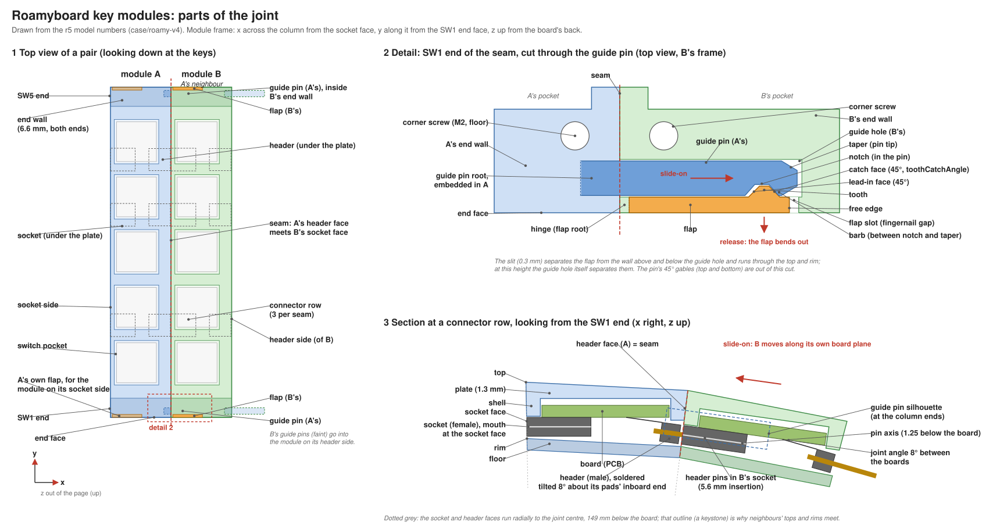

# Glossary

One term per concept. Use the bold term in code, docs, commits and conversation; the terms under "not" are discouraged synonyms.

## Modules

- **module**: One printed unit of the keyboard that couples to its neighbours side by side. Kinds: key module, MCU module, terminator module. Not: block, piece.
- **key module**: A module carrying one column of five keys: shell, floor and board. `KeyModule*` in `case/roamy-v4`. Not: column module, column (for the part).
- **MCU module**: The module at the header-side end of a half, carrying the nice!nano, battery and display. It has a socket side only, so no header pins stand exposed. Not: brain module, controller module.
- **terminator module**: The module at the socket-side end of a half. It has a header side only: two headers, embedded in the print, tie DATA to +3.3V so the chain reads the end-of-chain sentinel. Not: end cap, terminator plug.
- **MCU board**: The MCU module's planned PCB: sockets at the key module board's positions, the nice!nano and the power parts.
- **socket board**: A spare key module board with only its sockets populated, wired to the nice!nano; it stands in for the MCU board. The MCU module takes either.
- **free face**: The long side of the MCU or terminator module that has no joint side: the MCU module's header side and the terminator module's socket side. It stands perpendicular to the top. Not: outer face, outer side.
- **bay**: The MCU module's space beside its board, holding the battery, the nice!nano, the battery jack, the power switch and the reset button.
- **lug**: A part on a module's free face that the harness attaches to. Only the MCU and terminator modules have free faces. Not: harness fastener, clip, belt clip, hook.
- **column**: The line of keys that one key module carries, as a typing concept. The part is a key module.
- **neighbour**: The module on a module's header side. In a pair, A is the module carrying the guide pins and headers, and B is A's neighbour, carrying the guide holes, flaps and sockets that meet them. Not: next module, left/right module.
- **header side**, **socket side**: The two long sides of a module, named by the connector each carries. Not: left/right, male/female side.
- **SW1 end**, **SW5 end**: The two ends of a key module, named by the switch nearest each. **Column end** when either will do. Not: top/bottom end, front/back.

## Shell and floor

- **shell**: The top part of a module: plate, side walls and end walls, open at the bottom. Prints top-down. Not: case top, lid, top case.
- **floor**: The bottom part, screwed into the shell from below. Prints bottom-down. Not: bottom plate, base, lid.
- **board**: The key module's PCB. It drops into the upturned shell along its normal.
- **plate**: The 1.3 mm top of the shell that the switches clip into. Not: top plate (confused with the shell).
- **switch pocket**: The 15.3 mm recess in the plate's top that each switch's top housing sits in. **Switch opening**: the 13.7 mm hole through the plate at the pocket's floor. **Seat**: the ring of the pocket's floor between the opening and the pocket wall, which the top housing rests on; the **seat chamfer** bevels its inner edge. Not: pocket rim, flange.
- **side wall**: The long wall on the header side or socket side, 1.8 mm at the board plane. Its outer face is the **header face** or **socket face**.
- **end wall**: The 6.6 mm wall at each column end. It holds the guide hole and flap on the socket side, the guide pin's root on the header side, and two corner screws. Its outer face is the **end face**.
- **top**, **rim**, **bottom**: The three planes of a module's outline: the shell's upper surface, where shell meets floor, and the floor's underside. Each lies perpendicular to the bisector of the header and socket faces.
- **keystone**: The module's outline in section. The header and socket faces run radially to the joint centre, so neighbours' tops and rims meet.
- **corner screw**: One of four M2 screws holding the floor, in the end walls' corners.
- **ledge**: A strip on the shell's underside that stops the board from rising. **Ledge tab**: a short ledge between switch housings on the socket side.
- **locating tab**: A 1.0 mm rib on the floor that locates it in the shell's opening.
- **pillar**: A post on the floor that presses the board against the ledges.

## Connectors

- **header**: The male 3-pin connector on the board's back, header side. Soldered tilted 8° in the solder jig. Its **header pins** leave along the neighbour's board plane. Not: plug, male.
- **socket**: The female 3-pin connector on the board's back, socket side. Its **mouth** lies in the socket face, 2.0 mm past the board edge. Not: receptacle, female.
- **connector row**: One header-and-socket position along the column; three per module, at board y 58.1, 77.1 and 115.1 mm.
- **pin axis**: The line the header pins and socket bores share, 1.25 mm below the board.
- **tail**: The part of a header pin or socket contact behind the body: it leaves the body's **rear face** (opposite the mouth or the exposed pins) at the pin axis and jogs to the board. Its **foot** is the straight end that lies on the pad. Not: leg, lead.
- **clamp pad**: The part of the floor that rests on a connector body's face away from the board, with zero interference, so the body can't tip toward the floor. The header's follows its 8° tilt. Not: hold-down, clamp.
- **rear stop**: The rib on the floor against a connector body's rear face, below the tails; slide-on pushes the body against it instead of against its solder joints. Not: backstop, end stop.
- **staking**: Glue (gel CA) between a connector body's long sides and the board, which carries separation. Not: potting, underfill.

## Joint

- **joint**: Everything that couples a module to its neighbour: the keystone faces, the connectors, the guide pins and the latches.
- **joint side**: The joint hardware on one side of a module, behind the `JointSide` protocol: `HeaderSideJoint` (guide pins) or `SocketSideJoint` (guide holes and latches). A module hosts a joint side without knowing how the latch works. The joint side's **reserved** blocks are the part of the host's body that it owns, in the end walls; its **keep-out** is space outside the body that the host leaves empty.
- **seam**: The plane where a module's header face meets its neighbour's socket face.
- **joint angle**: The 8° between neighbouring boards. **Joint centre**: the axis 149 mm below the board that the neighbour's pose rotates about.
- **slide-on**: The straight move that couples B onto A, along B's board plane (8° down in A's frame). Its last 5.6 mm is **insertion** of the header pins into the sockets. Not: snap on, push in.
- **guide pin**: The gabled bar that protrudes from A's header face at each column end and enters B's guide hole before the header pins reach the sockets; it aligns the pair across the column and vertically. Its tip is the **taper**. Not: peg, dowel, prong, tongue (v3's T rail).
- **guide hole**: The hole in B's socket-side end wall that takes the guide pin.
- **latch**: The flap, tooth and notch together; it holds a pair against pulling apart. There are two per seam, one at each column end.
- **flap**: The outer 1.0 mm skin of B's end wall over the guide hole, free to bend outward. It is cut free by the **slit** behind it (0.3 mm, above and below the guide hole, through top and rim) and fixed at its **hinge** near the socket face. Its other end is the **free edge**, with the **flap slot** (a fingernail gap) beyond it. Not: pull tab, tab (tabs are the floor's locating tabs and the ledge tabs), clip, lever.
- **tooth**: The bump on the flap's inner face that drops into the notch. Its **lead-in face** points toward the seam; the guide pin pushes it outward during slide-on. Its **catch face** points away from the seam; it bears on the barb when the pair is pulled apart, and its angle is `toothCatchAngle`. Not: hook, catch (for the whole tooth).
- **notch**: The recess in the guide pin's outer face that the tooth drops into.
- **barb**: The ridge of the guide pin between the notch and the taper. Its notch-side face meets the tooth's catch face; the barb and the tooth are the two halves of the latch's hold. Not: hook, catch, pin tip (the tip is the taper).
- **release**: Moving the tooth out of the notch.
- **separation**: Moving B off A, the reverse of slide-on. **Ejection**: separation driven by a mechanism rather than by hand.

## Printing

- **print pose**: How a part lies on the bed (`PrintPose`): the shell on its top, the floor on its bottom.
- **painted support**: Slicer support that the user paints on by hand, only under the guide pins. `tools/overhang.py` reads the zone from `shell-print-painted-support.stl`. Not: print aid, fin (the modelled break-away fins of r4 and r5, which printed as strands).
- **revision**: The `r<n>` engraved on each printed part, from `Revision` in `Parameters.swift`.
- **embed pause**: A pause in a print at which parts are dropped into open pockets and then printed over, so they end up captive.

## Firmware

- **chain**: The 74HC165s of one half, read by the MCU module as one serial stream on DATA: one byte per key module, nearest key module first. Not: daisy chain, scan chain, shift register chain.
- **sentinel**: The first byte of the chain with bit 7 set, fed by the terminator module as 0xFF. It ends the chain, and its index is the key module count. Not: terminator byte, end marker.
- **key module count**: The number of key modules in front of the sentinel. The firmware accepts a new count only after several consecutive scans observe it. Not: column count, chain length.
- **fault**: A read of the chain with no sentinel in it. Not: chain error, bad read.
- **physical column**: A key module's position in the chain, counted from 0 at the key module nearest the MCU module. Not: chain index, module index, hardware column.
- **keymap column**: The column of the 30-column keymap that a key module's keys are reported in. Not: logical column, layout column, matrix column.
- **anchor**: The end of a half that keymap columns are counted from, set per shield: the MCU module (`mcu`) or the terminator module (`terminator`). Not: origin, alignment, justification.
